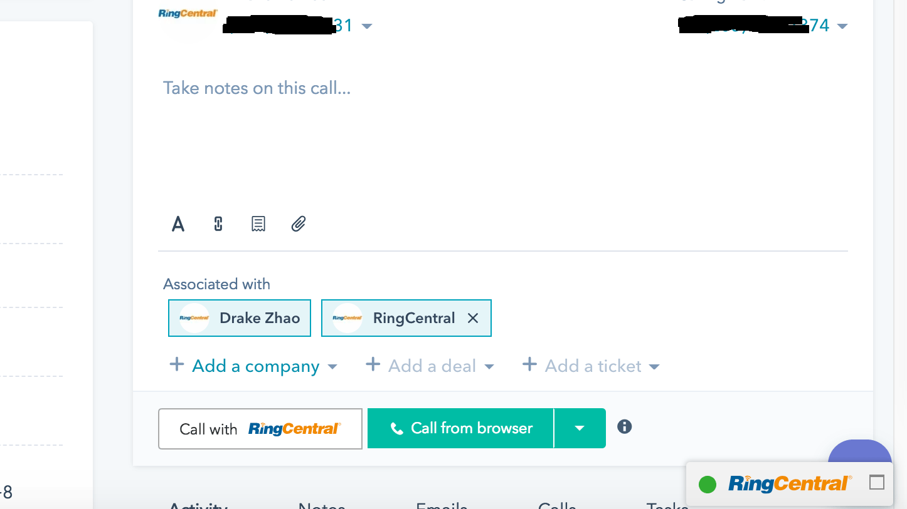
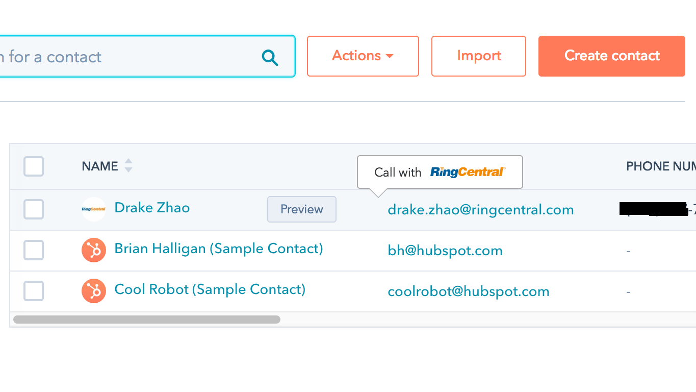
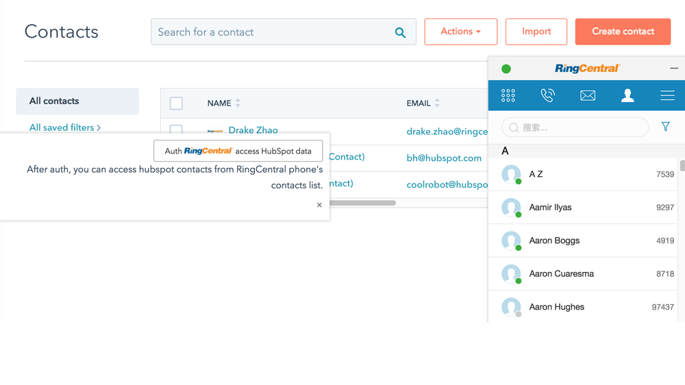
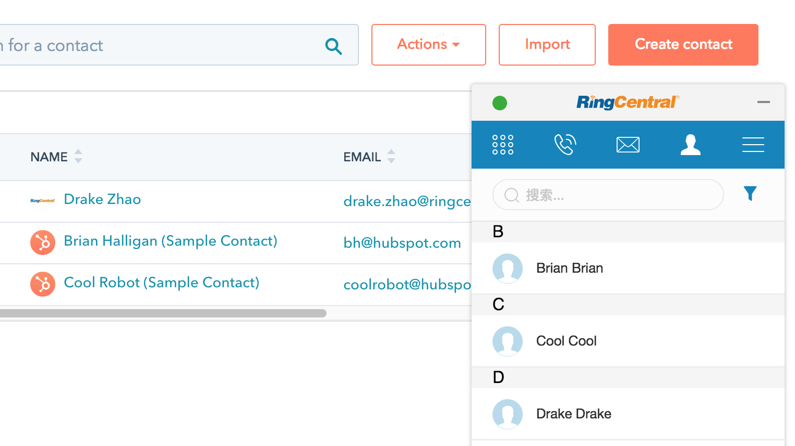
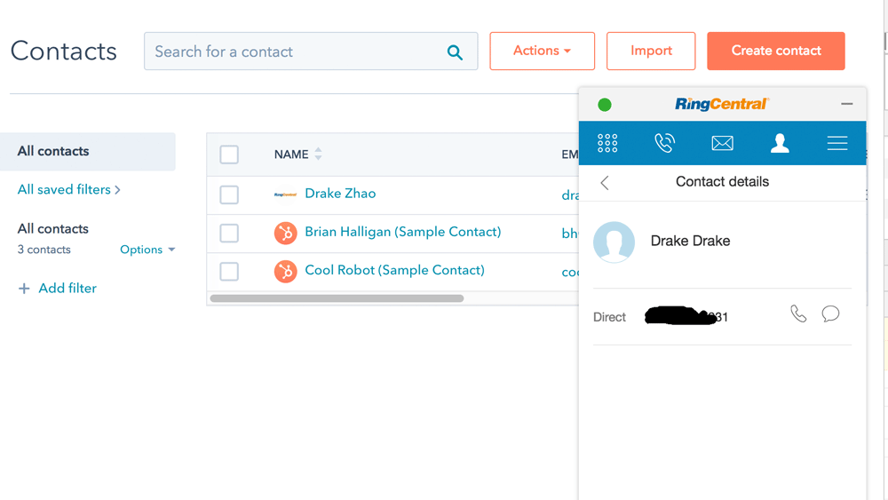

# RingCentral Embeddable Voice for HubSpot(chrome extension)
Add RingCentral Embeddable Voice widgets to hubspot contacts list and call contact page with chrome extension.

Created with [Embbnux Ji](https://github.com/embbnux)'s tuturial:
 [Building Chrome Extension Integrations with RingCentral Embeddable](https://medium.com/ringcentral-developers/build-a-chrome-extension-with-ringcentral-embeddable-bb6faee808a3)

| preview            |  preview |
:-------------------------:|:-------------------------:
 | 
 | 
 | 
 | 


## Features
- Click to call button
- Popup caller/callee info panel when call inbound
- build with custom app config

## Build and Use

1. build `content.js`
```bash
git clone https://github.com/zxdong262/hubspot-embeddable-ringcentral-phone.git
cd hubspot-embeddable-ringcentral-phone
npm i
cp config.sample.js config.js
# edit config.js, fill the required thirdPartyConfigs.clientIDHS and thirdPartyConfigs.clientSecretHS
# you can get the ID/Secret from https://app.hubspot.com/developer, register and create an app

# then run it
npm start
# edit src/*.js, webpack will auto-rebuild
```

2. Go to Chrome extensions page.
3. Open developer mode
4. Load `hubspot-embeddable-ringcentral-phone/dist` as unpacked package.
5. Go to `https://app.hubspot.com` to check

## Build with custom RingCentral clientID/appServer

Edit `config.js`, fill your RingCentral app's clientID and appServer, get it from https://developer.ringcentral.com/
```js

  ringCentralConfigs: {
    // your ringCentral app's Client ID
    clientID: 'your-clientID',

    // your ringCentral app's Auth Server URL
    appServer: 'your ringCentral app Auth Server URL'
  },
```

## License
MIT

